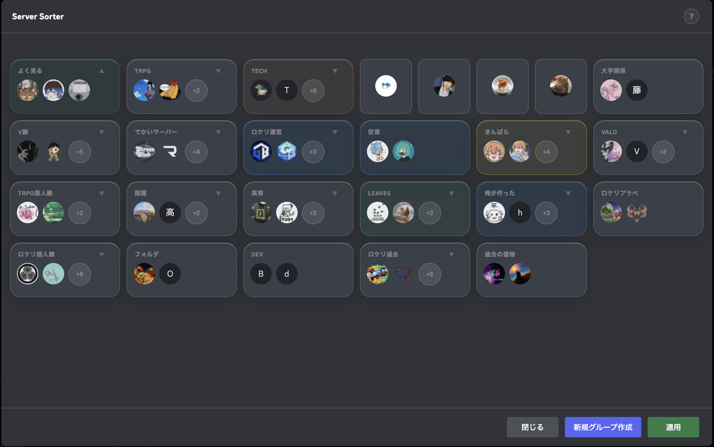

# ServerSorter

A Vencord plugin to sort and organize Discord servers via a drag & drop GUI.



> **For BetterDiscord, see the [`dev-betterDiscord`](../../tree/dev-betterDiscord) branch.**

## Features

- Folder card grid UI with liquid glass style
- Drag & drop to reorder servers and folders (FLIP animation)
- Move servers between folders (DnD merge / reorder by drop position)
- Right-click a folder to edit its name and color
- Create new groups
- Apply changes to Discord (proto store persistence)
- i18n support (Japanese / English, auto-detected from locale)
- First-launch tutorial overlay with re-openable info button

## Usage

1. Enable **ServerSorter** in Vencord settings
2. Click the folder icon in the server list to open the modal
3. Drag & drop to reorder servers and folders
4. Right-click a folder card to edit its name and color
5. Click **Apply** to save changes to Discord

## Installation

```bash
# Place in Vencord's userplugins directory
cp -r discord_sort /path/to/Vencord/src/userplugins/

# Build
cd /path/to/Vencord
pnpm build
```

## File Structure

```
discord_sort/
├── index.tsx     # Plugin definition & V2 modal UI
├── modalV1.tsx   # V1 archive (Docking Tray UI)
├── i18n.ts       # Translation strings (ja / en)
├── debug.ts      # Server move & persistence helpers
├── style.css     # Styles
└── discord.css   # Reference: available Discord CSS variables
```

## Progress

- [x] Guild & folder info retrieval (`GuildStore` / `SortedGuildStore`)
- [x] Server move & persistence (`GUILD_MOVE_BY_ID` + proto store)
- [x] Folder card grid UI (liquid glass style)
- [x] Drag & drop reorder (FLIP animation)
- [x] DnD merge / reorder between folders
- [x] Right-click to edit folder name & color
- [x] New group creation
- [x] Apply changes (proto store persistence)
- [x] Tutorial overlay with re-openable info button
- [x] i18n (ja / en)
- [ ] Offline apply detection
